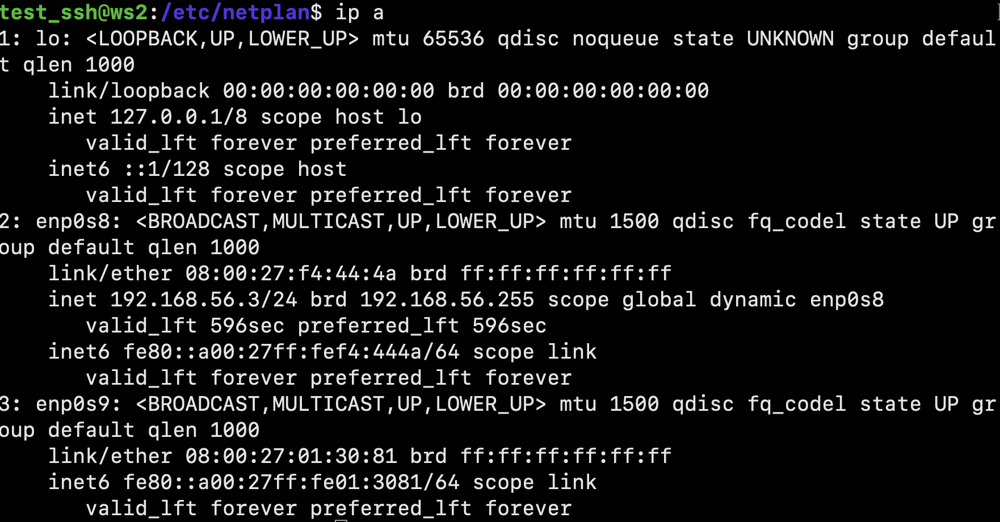
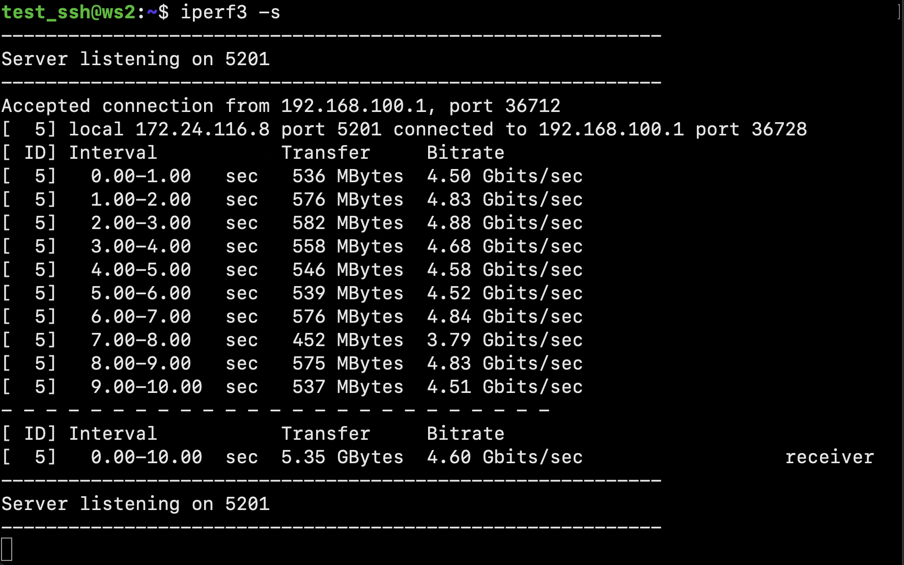

# Linux Network

## Part 1. ipcalc tool

### 1.1. Networks and Masks

1) network address of 192.167.38.54/13

2) conversion of the mask 255.255.255.0 to prefix and binary, /15 to normal and binary, 11111111.11111111.11111111.11110000 to normal and prefix

3) minimum and maximum host in 12.167.38.4 network with masks: /8, 11111111.11111111.00000000.00000000, 255.255.254.0 and /4

### 1.2. localhost

Define and write in the report whether an application running on localhost can 
be accessed with the following IPs: 194.34.23.100, 127.0.0.2, 127.1.0.1, 128.0.0.1
> localhost - 127.0.0.1/8

| IP | Value |
|:--------:| -------------:|
| 194.34.23.100, | false |
| 127.0.0.2 | true |
| 127.1.0.1 | true |
| 128.0.0.1 | false |

### 1.3. Network ranges and segments

Define and write in a report:
1) which of the listed IPs can be used as public and which only as private

| PUBCIC | PRIVATE |
|:--------:| -------------:|
| 134.43.0.2 | 10.0.0.45 |
| 172.0.2.1 | 192.168.4.2 |
| 192.172.0.1 | 172.20.250.4 |
| 172.68.0.2 | 172.16.255.255 |
| 192.169.168.1 | 10.10.10.10 |

2) which of the listed gateway IP addresses are possible for 10.10.0.0/18 network: 10.0.0.1, 10.10.0.2, 10.10.10.10, 10.10.100.1, 10.10.1.255

| possible | IMpossible |
|:--------:| -------------:|
| 10.10.0.2 | 10.0.0.1 |
| 10.10.10.10 | 10.10.100.1 |
| 10.10.1.255 | - |

## Part 2. Static routing between two machines

Start two virtual machines (hereafter -- ws1 and ws2)

View existing network interfaces with the ip a command

Describe the network interface corresponding to the internal network on both machines and set
the following addresses and masks: ws1 - 192.168.100.10, mask */16 *, ws2 - 172.24.116.8, mask /12

> The network interface `enp0s#` is a modern Linux network interface
> naming convention. It is part of the Predictable Network Interface
> Names scheme, which provides a consistent and predictable naming
> pattern for network interfaces. The name `enp0s9` is derived from the
> following components:
> 
> -   `en`: Denotes Ethernet.
> -   `p0`: Represents the bus number.
> -   `s#`: Signifies the slot number.

Run the netplan apply command to restart the network service

### 2.1. Adding a static route manually

Add a static route from one machine to another and back using a

Ping the connection between the machines

### 2.2. Adding a static route with saving

Add static route from one machine to another using etc/netplan/00-installer-config.yaml file

Ping the connection between the machines

## Part 3. iperf3 utility

### 3.1. Connection speed

-  8 Mbps = 1 MB/s
- 100 MB/s = 800 000 Kbps
- 1 Gbps = 1000 Mbps

### 3.2. iperf3 utility

    to download the iperf 3 utility, I switched the network from internal to nat in order to have internet access

Measure connection speed between ws1 and ws2

