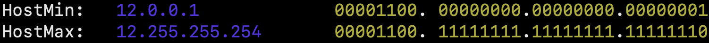
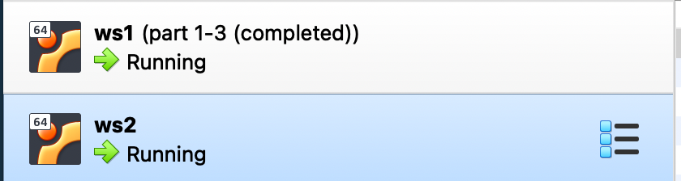
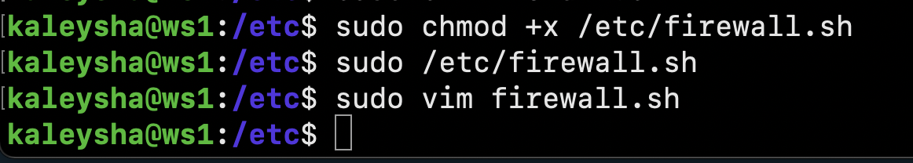
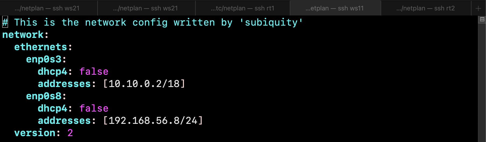
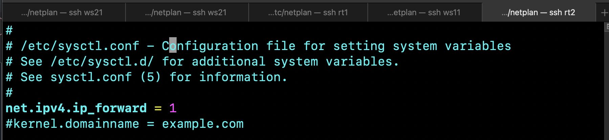
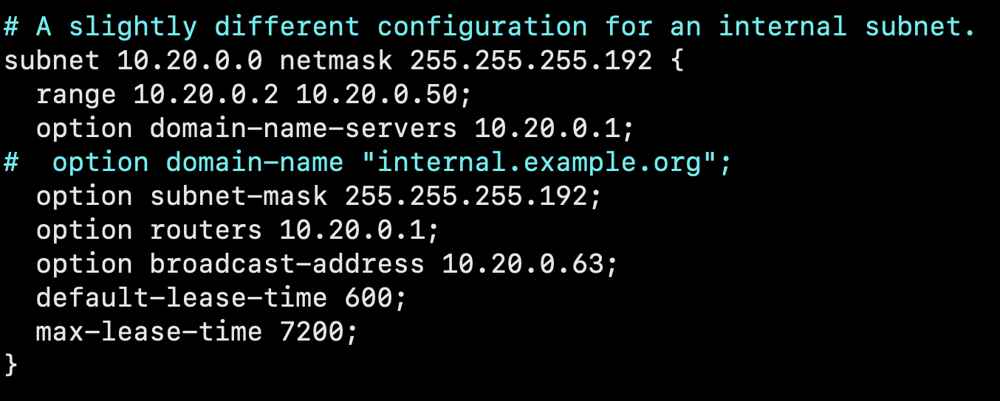
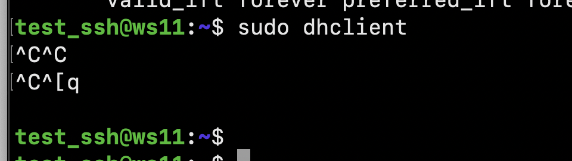
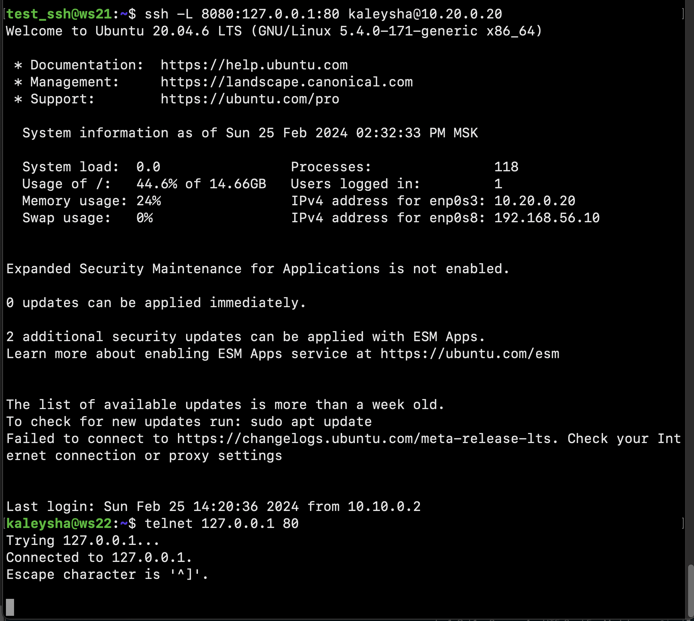

# Linux Network

## Part 1. ipcalc tool

### 1.1. Networks and Masks

1) network address of 192.167.38.54/13

2) conversion of the mask 255.255.255.0 to prefix and binary, /15 to normal and binary, 11111111.11111111.11111111.11110000 to normal and prefix

3) minimum and maximum host in 12.167.38.4 network with masks: /8, 11111111.11111111.00000000.00000000, 255.255.254.0 and /4

### 1.2. localhost

Define and write in the report whether an application running on localhost can 
be accessed with the following IPs: 194.34.23.100, 127.0.0.2, 127.1.0.1, 128.0.0.1
> localhost - 127.0.0.1/8

| IP | Value |
|:--------:| -------------:|
| 194.34.23.100, | false |
| 127.0.0.2 | true |
| 127.1.0.1 | true |
| 128.0.0.1 | false |

### 1.3. Network ranges and segments

Define and write in a report:
1) which of the listed IPs can be used as public and which only as private

| PUBCIC | PRIVATE |
|:--------:| -------------:|
| 134.43.0.2 | 10.0.0.45 |
| 172.0.2.1 | 192.168.4.2 |
| 192.172.0.1 | 172.20.250.4 |
| 172.68.0.2 | 172.16.255.255 |
| 192.169.168.1 | 10.10.10.10 |

2) which of the listed gateway IP addresses are possible for 10.10.0.0/18 network: 10.0.0.1, 10.10.0.2, 10.10.10.10, 10.10.100.1, 10.10.1.255

| possible | IMpossible |
|:--------:| -------------:|
| 10.10.0.2 | 10.0.0.1 |
| 10.10.10.10 | 10.10.100.1 |
| 10.10.1.255 | - |

## Part 2. Static routing between two machines

Start two virtual machines (hereafter -- ws1 and ws2)

View existing network interfaces with the ip a command

Describe the network interface corresponding to the internal network on both machines and set
the following addresses and masks: ws1 - 192.168.100.10, mask */16 *, ws2 - 172.24.116.8, mask /12

> The network interface `enp0s#` is a modern Linux network interface
> naming convention. It is part of the Predictable Network Interface
> Names scheme, which provides a consistent and predictable naming
> pattern for network interfaces. The name `enp0s#` is derived from the
> following components:
> 
> -   `en`: Denotes Ethernet.
> -   `p0`: Represents the bus number.
> -   `s#`: Signifies the slot number.

Run the netplan apply command to restart the network service

### 2.1. Adding a static route manually

Add a static route from one machine to another and back using a

Ping the connection between the machines

### 2.2. Adding a static route with saving

Add static route from one machine to another using etc/netplan/00-installer-config.yaml file

Ping the connection between the machines

## Part 3. iperf3 utility

### 3.1. Connection speed

-  8 Mbps = 1 MB/s
- 100 MB/s = 800 000 Kbps
- 1 Gbps = 1000 Mbps

### 3.2. iperf3 utility

> To download the iperf 3 utility, I switched the
> network from internal to nat in order to have internet access

Measure connection speed between ws1 and ws2

## Part 4. Network firewall

### 4.1. iptables utility

Create a /etc/firewall.sh file simulating the firewall on ws1 and ws2:

1) open access on machines for port 22 (ssh) and port 80 (http);
2) reject echo reply (machine must not ping, i.e. there must be a lock on OUTPUT);
3) allow echo reply (machine must be pinged);

- on ws1 apply a strategy where a deny rule is written at the beginning and an allow rule is written at the end (this applies to points 4 and 5);

- on ws2 apply a strategy where an allow rule is written at the beginning and a deny rule is written at the end (this applies to points 4 and 5);

Run the files on both machines with chmod +x /etc/firewall.sh and /etc/firewall.sh commands.

> on the first machine (ws1) echo-reply will be rejected, on the secoond - the exat opposite 

### 4.2. nmap utility

Use ping command to find a machine which is not pinged, then use nmap utility to show that the machine host is up

## Part 5. Static network routing

5.1. Configuration of machine addresses 

**- ws22**

**- ws21**

**- rt1**

**- rt2**

**- ws11**

Restart the network service. If there are no errors, check that the machine address is correct with the ip -4 acommand. Also ping ws22 from ws21. Similarly ping r1 from ws11.

### 5.2. Enabling IP forwarding.

> `IP forwarding,` also known as IP packet forwarding, is a function in
> network routers that allows the device to send data from one network
> segment to another. In the context of Linux, IP forwarding refers to
> the ability of the kernel to forward network packets from one network
> interface to another. This feature is essential for routing network
> traffic between different networks, enabling communication between
> subnets, and acting as a gateway.

To enable IP forwarding, run the following command on the routers:

Open /etc/sysctl.conf file and add the following line:

> `sysctl -p` this command is used to apply sysctl settings from the configuration file 

### 5.3. Default route configuration

Configure the default route (gateway) for the workstations. To do this, add default before the router's IP in the configuration file

Call ip r and show that a route is added to the routing table

Ping r2 router from ws11 and show on r2 that the ping is reaching. To do this, use the tcpdump -tn -i eth0

### 5.4. Adding static routes

Add static routes to r1 and r2 in configuration file.

Call ip r and show route tables on both routers.

Run ip r list 10.10.0.0/[18] and ip r list 0.0.0.0/0 commands on ws11.

> In the context of routing, the source IP address is used to specify
> the IP address of the network interface that is used to send traffic
> from the local system to a remote destination. The source IP address
> is used to identify the sender of the traffic and to ensure that the
> response traffic is sent back to the correct network interface. 
> 
> A default route is a route that is used when no other route is available
> for a destination IP address. It is a catch-all route for any traffic
> that does not match a more specific route. The default route is
> typically used to send traffic to the default gateway for all other
> destinations, such as the Internet or a wide area network.

### 5.5 Making a router list

Run the tcpdump -tnv -i eth0 dump command on r1
Use traceroute utility to list routers in the path from ws11 to ws21

>   It works by sending ICMP (Internet Control Message Protocol) echo
> request packets with increasing Time-to-Live (TTL) values. Each router
> along the path decrements the TTL value by one before forwarding the
> packet. When the TTL reaches zero, the router discards the packet and
> sends an ICMP Time Exceeded message back to the source. Traceroute
> uses these messages to determine the time it takes for each hop and to
> build a list of routers along the path

### 5.6. Using ICMP protocol in routing

Run on r1 network traffic capture going through eth0 with the
tcpdump -n -i eth0 icmp command.

Ping a non-existent IP (e.g. 10.30.0.111) from ws11 with the
ping -c 1 10.30.0.111 command.

## Part 6. Dynamic IP configuration using DHCP

For r2, configure the DHCP service in the /etc/dhcp/dhcpd.conf file:
- specify the interfaces dhcpd should listen to

- configure-/etc/dhcp/dhcpd.conf file

- configure nameserver in a resolv.conf file

- restart dhcp-service

- specify dhcp.service = true

- checking the new ip address

- ping ws22 machine 

Specify MAC address at ws11 by adding to etc/netplan/00-installer-config.yaml:

- configure host-fantasia (rt1)

- specify macaddress (ws11)

- checking the new ip address

- I can't request the new ip address cause i addeded static ip address (it'll be the same address)

## Part 7. NAT

In /etc/apache2/ports.conf file change the line Listen 80 to Listen 0.0.0.0:80on ws22 and r1, i.e. make the Apache2 server public

Start the Apache web server with service apache2 start command on ws22 and r1

Add the following rules to the firewall, created similarly to the firewall from Part 4, on r2:

Run the file as in Part 4

Check the connection between ws22 and r1 with the ping command

allow routing of all ICMP protocol packets

Check connection between ws22 and r1 with the ping command

- enable SNAT, which is masquerade all local ip from the local network behind r2 (as defined in Part 5 - network 10.20.0.0)
- enable DNAT on port 8080 of r2 machine and add external network access to the Apache web server running on ws22

Check the TCP connection for SNAT by connecting from ws22 to the Apache server on r1 with the telnet [address] [port] command

Check the TCP connection for DNAT by connecting from r1 to the Apache server on ws22 with the telnet command (address r2 and port 8080)

## Part 8. Bonus. Introduction to SSH Tunnels

Run a firewall on r2 with the rules from Part 7

Start the Apapche web server on ws22 on localhost only (i.e. in /etc/apache2/ports.conf file change the line Listen 80 to Listen localhost:80)

Use Local TCP forwarding from ws21 to ws22 to access the web server on ws22 from ws21

Use Remote TCP forwarding from ws11 to ws22 to access the web server on ws22 from ws11
